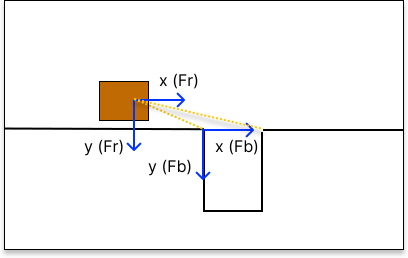
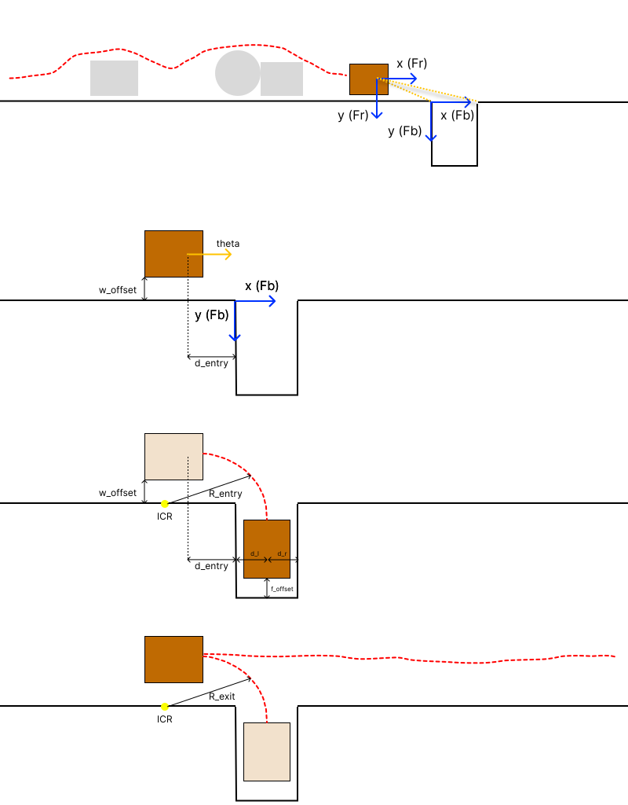

# Autonomous docking in a robot recharge room

Team: Davi Laurino (r1125223), Martina De Angelis (r1125657), Oleh Borys (r1127030)

This report describes the implementation of a robot that navigates along a wall, detects a docking bay on its right side, parks forward into it, and reverses back out after docking. The application is motivated by autonomous service robots that must periodically recharge without human intervention.

## 1. Specifications, world model, and design requirements

### Specifications

- The robot navigates at a maximum wall-following speed of $v_{max}=0.5\,\text{m/s}$, selected to allow sufficient reaction time upon bay detection while remaining practical for indoor navigation.

- The maximum acceleration and deceleration are limited to $a_{max}=0.2g$ to ensure smooth motion and reduce wheel slip.

- During wall following, the robot maintains a minimum clearance of $w_{offset}=30\,\text{cm}$ from obstacles. This clearance requirement is relaxed inside the docking bay, where the bay geometry constrains the maneuver and the robot moves at lower speed.

- The docking bay has width $W_{bay}=40\,\text{cm}$ and depth $D_{bay}=50\,\text{cm}$.

- The robot must stop centered inside the bay, at a distance $f_{offset}$ from the front wall of the docking bay.

### Design requirements

The minimum detection distance must account for LiDAR reaction time, braking distance, entry-positioning distance, and the time needed to validate the bay anchors over multiple scans.

The LiDAR scans at frequency $10 \, \text{Hz}$, so the robot travels

$$
d_{react}=\frac{v_{max}}{f} = 0.050 \, \text{m}
$$

before it can react to a newly detected feature. 

The stopping distance under maximum deceleration is

$$
d_{stop}=\frac{v_{max}^2}{2a_{max}} = 0.064 \, \text{m}
$$

The robot must also stop a distance $d_{entry}$ before the bay opening to position itself for the entry maneuver. Therefore, the bay must be detected at least

$$
d_{detect}=d_{react}+d_{stop}+d_{entry}
$$

before the robot reference point reaches the planned entry position.

### Reference Frames and Control Variables

The system coordinates maneuvers using two distinct reference frames, as visualized below.

- Robot frame $\mathcal{F}_R$: Used for local obstacle avoidance and wall-following. Raw LiDAR returns are converted to Cartesian points in this frame.
- Bay frame $\mathcal{F}_B$: An environment-fixed frame initialized once the docking bay is validated. Its origin is at the near entrance corner, it is used for the docking and exit arcs.

Actuation is defined by the left and right front-wheel velocities. For path planning, these are mapped to mean forward velocity and differential velocity.

$$
v_m=\frac{v_l+v_r}{2}
\qquad
v_d=\frac{v_r-v_l}{2}
$$

The unmeasured steering-module angle $\hat{\alpha}$ is continuously estimated via kinematics and wheel odometry, and corrected when wall alignment is confirmed.

### LiDAR Processing Pipeline

The robot does not treat single LiDAR clusters as permanent landmarks. To avoid false positives, the feature extraction follows a rigorous pipeline: Points -> Local Clusters -> Classification -> Anchors.

Bay detection is restricted to a maximum range of approximately $r_{max}=2\,\text{m}$. With the LiDAR angular resolution of $0.5^\circ$, $\Delta \theta = 0.00873\,\text{rad}$. The nominal spacing between adjacent rays at this range is

$$
\Delta s \approx r_{max}\Delta\theta = 0.0175\,\text{m}
$$

or about $1.75\,\text{cm}$. Therefore, the cluster-splitting threshold can be chosen as $d_{split} = 4 \,\text{cm}$, which remains safely above the nominal adjacent-point spacing at the maximum detection range while being much smaller than the docking-bay width $W_{bay}=0.40\,\text{m}$. This makes the bay entrance easier to separate from the continuous wall while still avoiding excessive fragmentation due to LiDAR discretization and noise.

1. Clustering and wall fitting

Splitting: Sequential LiDAR points are grouped into a local cluster. A new cluster starts if the distance between adjacent points exceeds a threshold: $\|p_i-p_{i-1}\| > d_{split}$

Merging: Adjacent clusters are merged into "superclusters" if they share a low line-fit residual, have parallel directions, and their endpoints are close. Unmerged clusters are treated as generic obstacles.

2. Bay-anchor detection during wall-following

The robot scans for two specific geometric signatures:

Near Anchor $p_{near}$: Detected as a sharp, sudden termination of the right-wall supercluster.

Far Anchor $p_{far}$: Detected as an L-shaped corner. It requires two intersecting superclusters (the corridor wall and the bay's inner wall) with orientations satisfying $|\phi_1-\phi_2| \approx 90^\circ$

The gap is flagged as a candidate bay only if the opening width matches the specifications and is free of obstacles:

$$
W_{gap}=\|p_{far}-p_{near}\|\in[W_{bay}-\epsilon,\;W_{bay}+\epsilon]
$$

3. Anchor Tracking and Validation

Because the robot moves, candidate anchors are tracked over time to filter out noise and moving objects. Each tracked feature stores its position, type, and hit/miss counters.

Odometry Prediction: Between scans, the expected anchor position in the current robot frame is updated: $\hat{p}_{new}=T_{odom}p_{old}$

Gating: A new LiDAR measurement updates a track only if it falls within the gating radius: $\|p_{measured}-\hat{p}_{new}\|<r_{gate}$

Confirmation: The bay is definitively accepted, and $\mathcal{F}_B$ is initialized, only if both anchors are consistently re-observed for $N = 3$ consecutive scans.

## 2. Finite State Machine

- **State 1: Wall following and bay scanning.**
  Navigates the corridor while searching for the docking bay.

  - **Transition a:** Valid bay anchors detected.

- **State 2: Decelerate and position.**
  Stops precisely at the entry point $d_{entry}$ using a controlled deceleration profile.

  - **Transition b:** Robot stationary at the entry position.

- **State 3: Forward entry arc.**
  Executes a guided arc into the bay using the validated bay-fixed frame $\mathcal{F}_B$.

  - **Transition c:** Arc complete, robot aligned inside the bay.

- **State 4: Final docking.**
  Moves forward slowly, centering itself between the side walls using direct LiDAR feedback.

  - **Transition d:** Robot stationary, centered in the bay, at the docking offset.

- **State 5: Reverse undocking.**
  Reverses out of the bay performing a mirror exit maneuver, and re-aligns with the corridor.

  - **Transition e:** Exit arc complete, wall following resumed.

## 3. Control strategies per state

### State 1: Wall following and bay scanning

The wall-following controller evaluates a deterministic list of short candidate motions, ordered from most right-leaning to most left-leaning: $$\mathcal{U}_1 =[u_{HR},u_{SR},u_{S},u_{SL},u_{HL},u_{stop}]$$

For each candidate, the robot predicts a swept safety corridor over a short control horizon, including the $w_{offset}$  margin. For straight motion, the corridor width is 

$$W_{robot}+2w_{offset}$$

For turning motion, the swept region is approximated by the annular sector between: 

$$
R_{inner} = R-\frac{W_{robot}}{2}-w_{offset}\qquad R_{outer} = R+\frac{W_{robot}}{2}+w_{offset}
$$
 
where $R$ is the nominal turning radius of the candidate motion.

A candidate is rejected if any LiDAR point or obstacle cluster lies inside its swept safety corridor.
The first candidate with a collision-free corridor is executed.

The robot transitions to State 2 only when all of the following conditions are satisfied:

- the near wall-termination feature has been confirmed;
- the far L-shaped corner feature has been confirmed;
- the anchor separation satisfies $\|p_{far}-p_{near}\|\in[W_{bay}-\epsilon,\;W_{bay}+\epsilon]$
- the opening between the anchors is free;
- the bay frame $\mathcal{F}_B$ has been initialized;
- the robot is still far enough from the planned entry point to decelerate safely and stop at distance $d_{entry}$ before the bay opening.

State 1 then outputs the confirmed bay anchors, the bay-fixed frame, and the planned stopping position for the entry maneuver.

### State 2: Deceleration and entry positioning

The robot must stop at a remaining longitudinal distance $d_x = x_{entry}-\hat{x}$.

The longitudinal motion is controlled by a Proportional-Integral-Derivative (PID) braking law to ensure a smooth stop and eliminate steady-state position errors: 

$$
v_m = k_p d_x + k_i \int d_x dt + k_d \dot{d}_x
$$

where $v_m$ is the mean front-wheel velocity.

The angular state $\mathbf{x}_{\theta} =
\begin{bmatrix}e_\theta \\\hat{\alpha}
\end{bmatrix}$ is stabilized separately using a gain-scheduled LQR.

The local angular dynamics are linearized around the current mean velocity $v_m$:

$$
\dot{\mathbf{x}}_{\theta} =
A_\theta(v_m) \mathbf{x}_\theta +
B_\theta v_d
$$
with
$$
A_\theta(v_m)=
\begin{bmatrix}
0 & \frac{v_m}{L} \\
0 & -\frac{v_m}{L}
\end{bmatrix}
\qquad
B_\theta=
\begin{bmatrix}
0 \\
\frac{2}{l}
\end{bmatrix}
$$

The LQR control law is then:

$$
v_d = -K_\theta(v_m)\mathbf{x}_\theta
$$

with the gain being computed everytime for new values of $v_m$. State 2 ends when the robot is sufficiently close to the entry point: $|d_x|<\epsilon_x$.

### State 3: Anchor-based entry arc

The entry path is a circular arc of radius $R_{entry}$ in the bay frame and the robot moves at a constant low speed $v_{arc}$. The steering-module requires a nominal angle:

$$
\alpha_{ff} = \arcsin\left(\frac{L}{R_{entry}}\right)
$$

 where $L$ is the effective wheelbase. To maintain this, a feedforward differential velocity is applied:

$$
v_{d,ff} = \frac{l v_{arc}}{2R_{entry}}
$$

The visible bay anchors and side-wall clusters are used to estimate the tracking error relative to the planned path. The feedback state is

$$
\mathbf{x}_3 =
\begin{bmatrix}
e_{path} \\
e_\theta \\
e_\alpha
\end{bmatrix}
$$

and the differential velocity command is

$$
v_d = v_{d,ff} - K_3\mathbf{x}_3
$$

The maneuver ends when the robot has completed the planned arc and its heading is approximately aligned with the bay axis. The robot must finish the arc with the anchor points still visible in the lidar angular range.

### State 4: Final docking approach

Inside the bay, the robot uses direct LiDAR measurements of the side walls $d_L, \; d_R$ to compute the centering error 

$$
e_c=\frac{d_R-d_L}{2}
$$

The robot moves forward with a low constant mean velocity $v_m=v_{dock}$ and applies a Proportional-Integral-Derivative (PID) correction to prevent lateral oscillations and compensate for steady-state misalignments: 

$$
v_d = -k_p e_c - k_i \int e_c dt - k_d \dot{e}_c
$$

The robot stops when $f \leq f_{offset}$ and docking is considered complete.

### State 5: Reverse undocking and bay exit

The robot mirrors the entry arc in reverse $v_m = -v_{rev}$. Because the relevant anchors are behind the robot and outside the LiDAR field of view, the nominal steering angle $\alpha_{exit}=-\alpha_{ff}$ is maintained open-loop using odometry.

The reverse arc ends when the odometry estimate indicates that the robot has returned to the wall-following corridor and has recovered approximately the original wall-parallel orientation. At that point, the wall-following controller is reactivated.

Because this state relies mainly on odometry, uncertainty increases throughout the maneuver. Therefore, the reverse speed is kept low and the exit path is designed with a larger safety margin than the forward docking path.
